<div align="center">

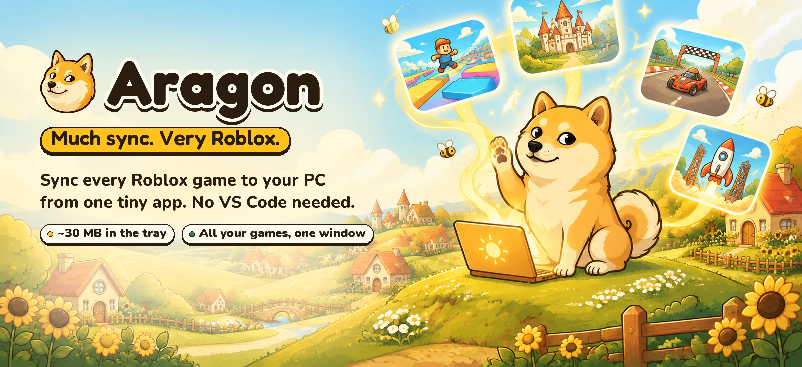

<br>

**Sync every Roblox game to your PC from one tiny app. No VS Code, no terminal, no config files.**

[](#-install)
[](../../releases/latest)
[](Cargo.toml)
[](LICENSE.md)

[**Download**](../../releases/latest) · [Why Aragon](#-the-problem) · [Features](#-features) · [Screenshots](#-screenshots) · [Install](#-install) · [FAQ](#-faq)

</div>

---

## 🐕 The problem

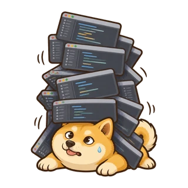

Syncing Roblox code to your PC has always meant building a small workstation around every single game:

- **One VS Code window per game.** Working on a lobby, a main game and a test place means juggling three editor windows, three terminals and three sync servers.
- **Heavy.** A VS Code window with Luau tooling commonly sits at hundreds of MB of RAM before you've opened a file, and every extra game multiplies it.
- **Manual setup, every time.** Create a folder, write a `project.json`, start the server on the right port, connect the plugin, remember which port belongs to which place.
- **No overview.** Nothing tells you which of your games is mapped where, which ones you actually work on, or how much you built this week.

## ✨ The fix

**Aragon is one lightweight app that runs every game at once.** Open any place in Roblox Studio and the Aragon plugin connects by itself. The place shows up in the dashboard with its name, icon, place ID and universe ID, grouped under the user or group that owns it, and it's mapped to its own folder. Code syncs both ways right away.

<table>
<tr>
<td width="33%" align="center">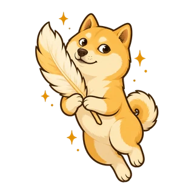<br><b>Light as a feather</b><br><sub>Lives in the tray at ~30 MB. The dashboard window only exists while it's open and frees its memory when you close it.</sub></td>
<td width="33%" align="center">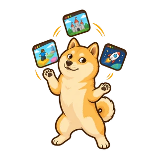<br><b>All your games, one window</b><br><sub>Every place you open in Studio syncs at the same time through a single hub. There's no window-per-game and no port juggling.</sub></td>
<td width="33%" align="center">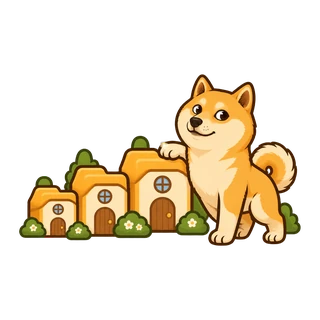<br><b>Every game gets a home</b><br><sub>Places map to <code>Projects/&lt;owner&gt;/&lt;game&gt;</code> automatically. A new place gets a friendly setup dialog.</sub></td>
</tr>
</table>

## ⚖️ Aragon vs the VS Code workflow

| | VS Code + a sync server | 🐕 **Aragon** |
|---|---|---|
| **Memory** | A full editor per project, commonly hundreds of MB to 1 GB+ with Luau extensions | **~30 MB** in the tray. The dashboard is freed when you close it |
| **Several games at once** | One VS Code window + one terminal + one server per game | **All of them in one app**, synced at the same time |
| **Connecting Studio** | Start the server, pick the port, press Connect | **Automatic.** Open a place and it's live |
| **New place setup** | Make a folder, write `project.json`, run init | **One dialog**, with folder chosen for you |
| **Finding your games** | You remember IDs | Names, icons, place and universe IDs from Roblox, **grouped by owner** |
| **Settings** | JSON files and plugin menus | **One Settings page**, with per-place overrides |
| **Knowing what you built** | Nothing | **Lines written per day, LOC, time synced, streaks** |
| **Needs installed** | VS Code, extensions, CLI, PATH setup | **One `.exe`**. The Studio plugin is inside it |

## 🎯 Features

- 🔌 **Auto-connecting Studio plugin.** Connect is the plugin's whole job. It sends the place ID and your Studio user ID, reconnects on its own and scales to any widget size without scrolling.
- 🗺️ **Your games, found for you.** Games, groups and places load from Roblox's public APIs using your Studio user ID. An **Open Cloud API key is optional**; adding one includes private group experiences. It's stored in Windows Credential Manager, never in a file.
- 🏆 **Most-worked-on first.** Places are ranked by activity over the last 14 days.
- 📈 **Analytics.** Lines written per day, lines of code per place, language mix, time synced and a coding streak.
- 🧑‍💻 **Built-in code editor.** Monaco with a file tree. `Ctrl+S` saves and Studio updates instantly. Studio's *Open In Editor* opens the file here.
- ⚙️ **Every sync setting in one place.** All sync engine and Studio plugin options are editable from the dashboard, globally or per place. Defaults: Studio's version wins on first sync, and unknown instances are kept.
- 🛠️ **One-click actions.** Run Luau in Studio, build `.rbxl` files, install Wally packages, open a place in Studio or Creator Hub, or reveal its folder.
- 👋 **First-run welcome.** Aragon installs its Studio plugin with one button and can restart Studio for you. Studio still asks to save first.
- 🌻 **A dashboard you'll like opening.** A hand-drawn shiba town with drifting clouds and bees, GPU-composited so it stays smooth and light.

## 📸 Screenshots

<div align="center">

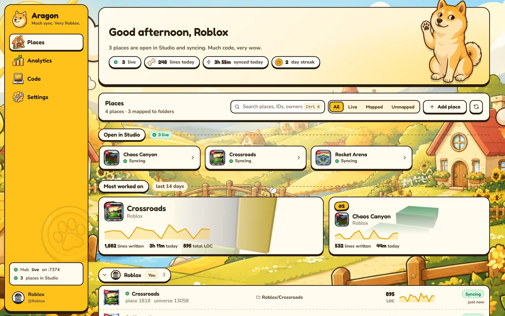
<sub><b>Home.</b> Three games live in Studio at once, ranked by what you work on most, grouped by owner.</sub>

<br><br>

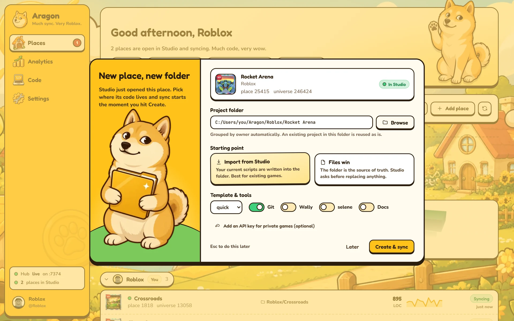
<sub><b>New place, new folder.</b> Open an unmapped place and Aragon asks where it should live.</sub>

</div>

<details>
<summary><b>More screenshots</b></summary>
<br>

| | |
|---|---|
| 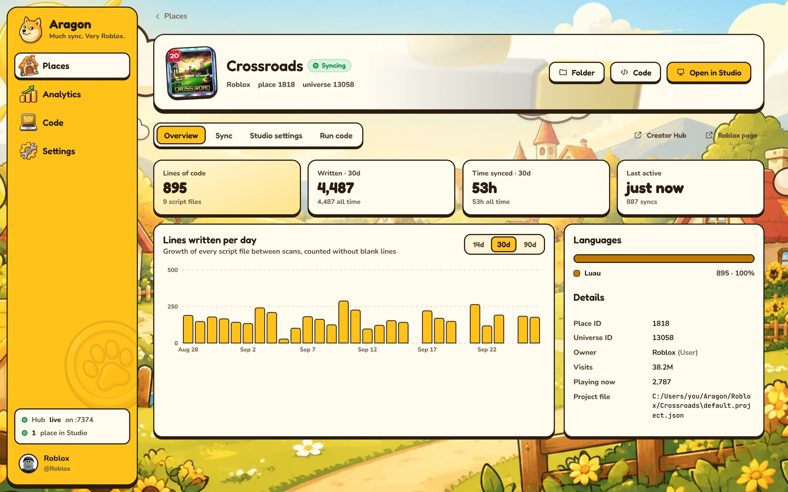<br><sub>Place page with stats and details</sub> | 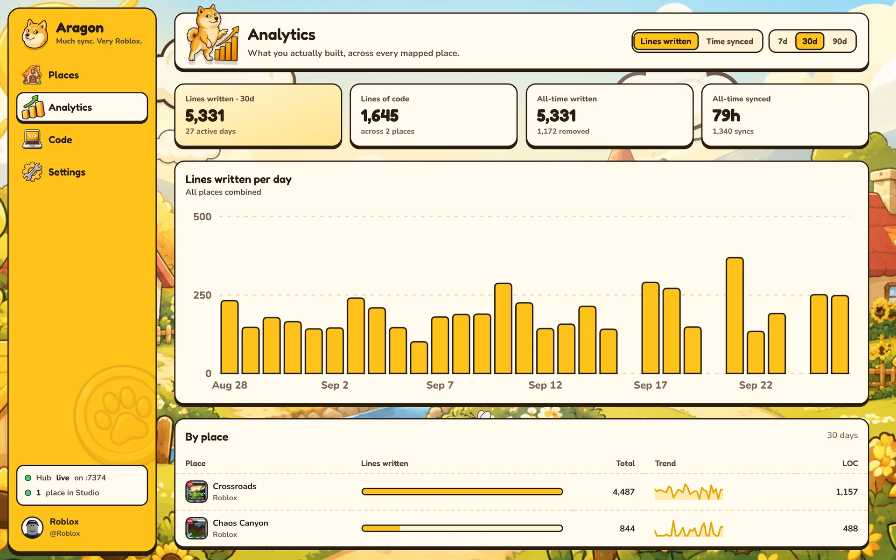<br><sub>Analytics across every place</sub> |
| 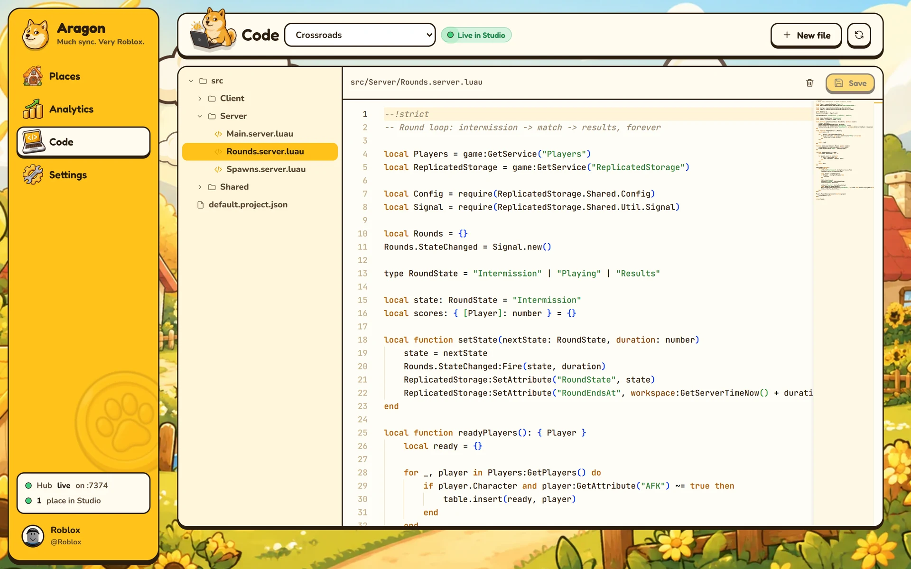<br><sub>Built-in editor, synced live</sub> | 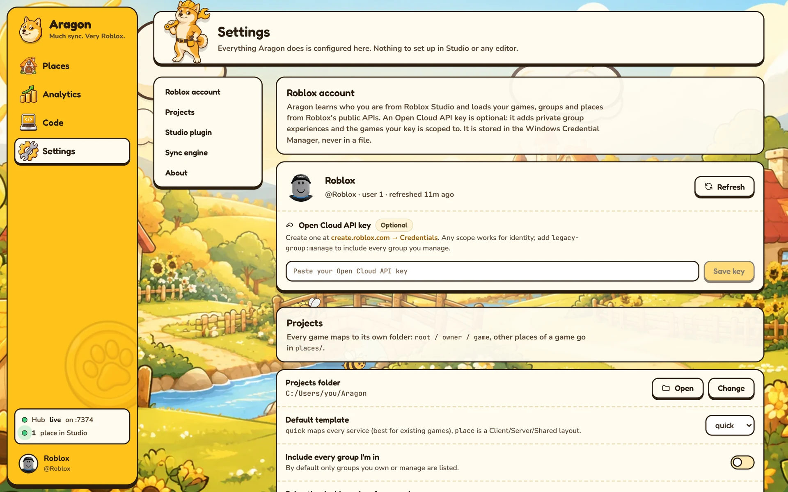<br><sub>All settings in one page</sub> |
| 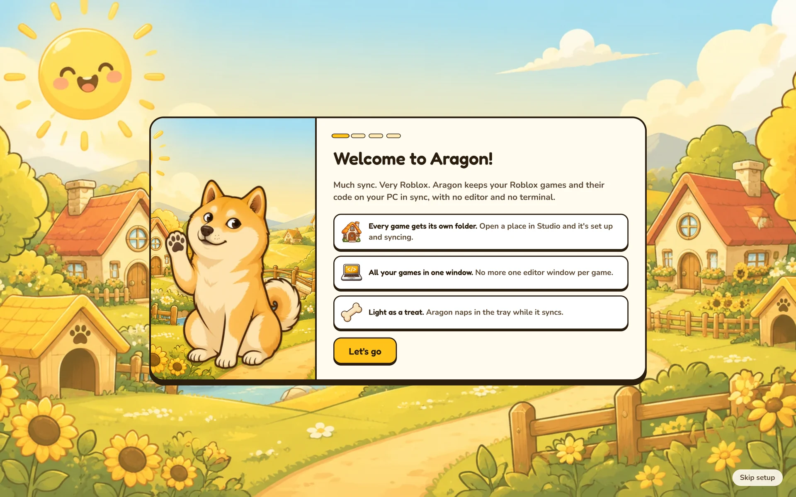<br><sub>First-run welcome</sub> | 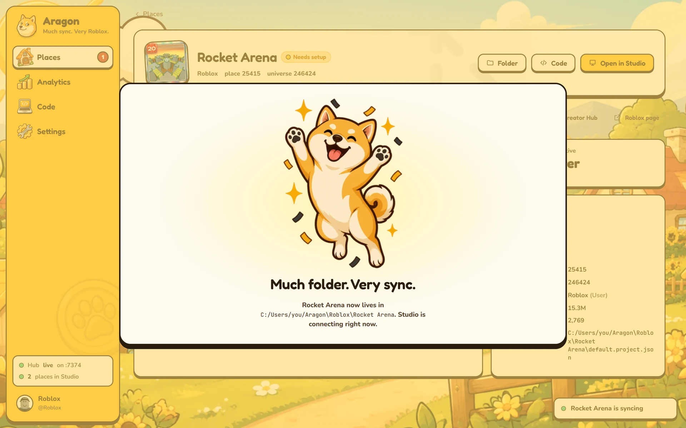<br><sub>Much folder. Very sync.</sub> |

</details>

## 📦 Install

1. Download `aragon-<version>-windows-x86_64.zip` from [**Releases**](../../releases/latest) and unzip it anywhere.
2. Run **`aragon.exe`**. The welcome screen installs the Studio plugin with one click, and restarts Studio if it's open.
3. Open any place in Roblox Studio. It shows up in the dashboard. Pick a folder and you're syncing.

Aragon keeps running in the system tray after you close the window, so Studio can always connect. Click the tray icon to reopen the dashboard, or right-click it to quit.

> [!NOTE]
> The dashboard uses Microsoft Edge **WebView2**, which ships with Windows 10 and 11. Without it, the dashboard opens in your browser instead.

<details>
<summary><b>Command line</b></summary>

`aragon` with no arguments starts the hub and opens the dashboard. Useful flags:

| Command | What it does |
|---|---|
| `aragon dashboard --background` | Start in the tray without opening the window |
| `aragon dashboard --headless` | Run the hub only, no window or tray |
| `aragon dashboard --port 7373` | Use a different hub port |
| `aragon plugin install` | Reinstall the bundled Studio plugin |

The original Argon commands (`serve`, `build`, `sourcemap`, `init`, …) still work for scripting.

</details>

## 🧠 How it works

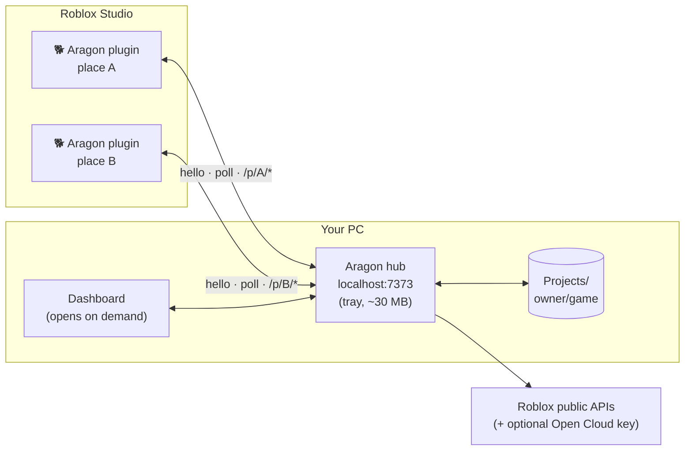

- **One hub, many places.** Every place gets its own sync core under `/p/<placeId>/`. Opening another place in Studio adds another core, not another app.
- **The plugin only connects.** It says hello and long-polls for instructions. All settings, mapping and onboarding live in the dashboard.
- **Nothing leaves your PC** except requests to Roblox's own APIs to resolve names and thumbnails. Analytics are stored locally in `~/.aragon`.

## ❓ FAQ

<details><summary><b>Do I need VS Code, Rojo or Argon installed?</b></summary><br>No. Aragon is a single executable with the Studio plugin built in. You can still open project folders in any editor if you want to.</details>

<details><summary><b>Do I need a Roblox API key?</b></summary><br>No. Aragon finds your games and groups through public endpoints using the user ID Studio reports. An Open Cloud key only adds private group experiences, and it's stored in Windows Credential Manager.</details>

<details><summary><b>Does it work with existing Rojo/Argon projects?</b></summary><br>Yes. Point a place at a folder with a <code>*.project.json</code> and Aragon reuses it as is.</details>

<details><summary><b>Why does the dashboard use more memory while it's open?</b></summary><br>The window is a WebView2 page. Closing it destroys the webview, so Aragon drops back to its ~30 MB tray footprint while it keeps syncing.</details>

<details><summary><b>macOS / Linux?</b></summary><br>Aragon 1.0 targets Windows. The sync engine is cross-platform (it comes from Argon), so ports are possible later.</details>

## 🔨 Build from source

Requirements: Rust (stable), MSVC Build Tools + Windows SDK, and [Rokit](https://github.com/rojo-rbx/rokit) for the Roblox tools.

```bash
rokit install
cd plugin && wally install && cd ..
scripts\cargo.cmd build --release
```

`scripts\cargo.cmd` finds your MSVC install through `vswhere`. The Studio plugin is built with Rojo and embedded into `target\release\aragon.exe`. Set `ARAGON_DASHBOARD_DIR=dashboard` to serve the dashboard from disk while you work on the UI.

Project layout:

| Path | What's there |
|---|---|
| `src/hub/` | Hub server, place store, Roblox resolver, analytics, tray + window |
| `src/` (rest) | Argon's sync engine, CLI and server |
| `dashboard/` | The dashboard UI (Preact + htm, no build step) |
| `plugin/` | The Studio connector plugin (Luau, Fusion) |
| `assets/branding/` | Mascot and brand art |

## 🙏 Credits

Aragon is built on [**Argon**](https://github.com/argon-rbx/argon) by [Dervex](https://github.com/DervexDev), the sync engine, CLI and original plugin. Both are licensed under Apache-2.0. See [NOTICE](NOTICE) for details. Aragon is not affiliated with Roblox Corporation or with the Argon project.

## 📄 License

[Apache-2.0](LICENSE.md). Much free. Very open.
